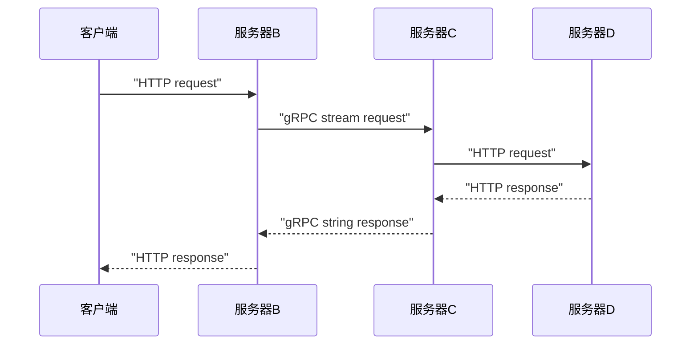

## xyDemo

这是一个gRPC双向流式通信的Demo

```mermaid
sequenceDiagram
    participant 客户端
    participant 服务器B
    participant 服务器C
    participant 服务器D

    客户端->>服务器B:"HTTP request"
    服务器B->>服务器C:"gRPC stream request"
    服务器C->>服务器D:"HTTP request"
    服务器D-->>服务器C:"HTTP response"
    服务器C-->>服务器B:"gRPC string response"
    服务器B-->>客户端:"HTTP response"
```